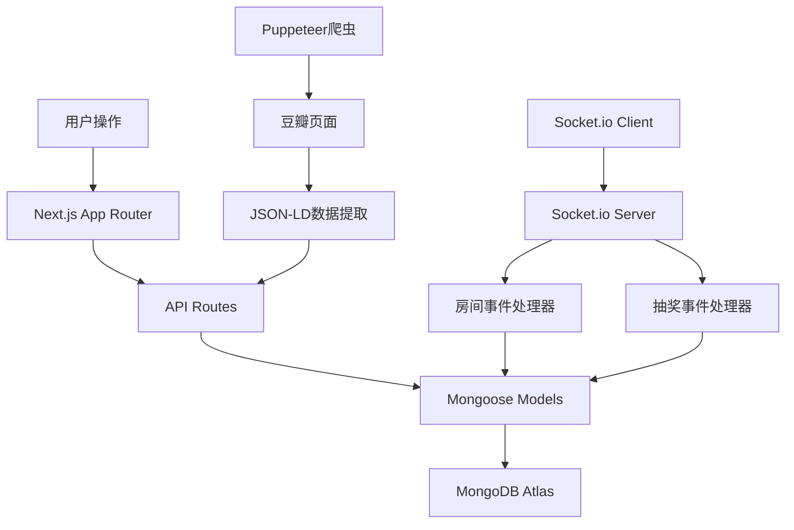

## 产品概述

影片随机抽取Web应用，支持多人在线实时抽奖决定观看影片。用户可通过豆瓣链接自动爬取或手动添加影片至个人影片库，创建/加入房间后，房主发起老虎机式随机抽奖，所有参与者实时看到相同结果。

## 核心功能

- **用户认证系统**：注册、登录、会话管理（NextAuth.js v5）
- **影片库管理**：豆瓣链接自动爬取（Puppeteer）、手动添加、CRUD操作、海报网格展示
- **房间系统**：创建/加入房间、6位房间码、房主权限控制、参与者列表实时更新
- **随机抽奖**：老虎机式动画、确定性随机种子同步、所有用户看到相同结果
- **实时同步**：Socket.io多用户实时通信、房间状态同步、抽奖结果广播
- **历史记录**：抽奖历史查询、历史结果展示（新增功能）
- **手绘风格UI**：笔记本纸张质感、手写字体、柔和配色、Framer Motion动画

## 技术栈选择

- **框架**: Next.js 15 (App Router) + TypeScript
- **样式**: Tailwind CSS + Framer Motion + 自定义手绘主题
- **数据库**: MongoDB Atlas + Mongoose ODM
- **认证**: NextAuth.js v5 (Credentials Provider)
- **实时通信**: Socket.io + 自定义Next.js服务器
- **爬虫**: Puppeteer (无头浏览器，提取JSON-LD数据)
- **部署**: VPS云服务器 + PM2进程管理

## 技术架构

### 系统架构

采用分层架构模式：

- **表现层**: Next.js App Router页面 + React组件
- **业务逻辑层**: API Routes + Socket.io事件处理器
- **数据访问层**: Mongoose模型 + 数据库操作
- **实时通信层**: Socket.io服务器 + WebSocket连接

### 核心技术决策

1. **自定义Next.js服务器**：必须使用自定义服务器以集成Socket.io，放弃Vercel等平台的自动部署优势
2. **确定性随机算法**：使用时间戳作为种子，确保所有客户端看到相同的抽奖序列
3. **豆瓣爬虫策略**：提取页面JSON-LD结构化数据，避免复杂的DOM解析，提高稳定性
4. **MongoDB Atlas**：云数据库方案，避免本地数据库维护成本，支持自动备份和扩展

### 数据流设计



### 目录结构

```
/home/share/CodeBuddy/randomMovie/
├── src/
│   ├── app/                           # Next.js App Router
│   │   ├── (auth)/auth/
│   │   │   ├── login/page.tsx        # [NEW] 登录页面
│   │   │   └── register/page.tsx     # [NEW] 注册页面
│   │   ├── (main)/
│   │   │   ├── page.tsx              # [NEW] 首页
│   │   │   ├── movies/page.tsx       # [NEW] 影片库页面
│   │   │   └── room/
│   │   │       ├── create/page.tsx   # [NEW] 创建房间
│   │   │       ├── join/page.tsx     # [NEW] 加入房间
│   │   │       └── [code]/page.tsx   # [NEW] 房间详情
│   │   ├── api/
│   │   │   ├── auth/[...nextauth]/route.ts  # [NEW] NextAuth配置
│   │   │   ├── auth/register/route.ts       # [NEW] 注册API
│   │   │   ├── movies/
│   │   │   │   ├── route.ts          # [NEW] 影片CRUD
│   │   │   │   ├── [id]/route.ts     # [NEW] 单个影片操作
│   │   │   │   └── scrape/route.ts   # [NEW] 豆瓣爬虫API
│   │   │   ├── rooms/route.ts        # [NEW] 房间API
│   │   │   └── history/route.ts      # [NEW] 历史记录API
│   │   └── layout.tsx                # [NEW] 根布局
│   ├── components/
│   │   ├── ui/
│   │   │   ├── SketchButton.tsx      # [NEW] 手绘风格按钮
│   │   │   ├── SketchCard.tsx        # [NEW] 手绘风格卡片
│   │   │   ├── SketchInput.tsx       # [NEW] 手绘风格输入框
│   │   │   └── NotebookBackground.tsx # [NEW] 笔记本背景
│   │   ├── movie/
│   │   │   ├── AddMovieForm.tsx      # [NEW] 添加影片表单
│   │   │   ├── MovieList.tsx         # [NEW] 影片列表
│   │   │   ├── PosterCard.tsx        # [NEW] 海报卡片
│   │   │   └── MovieDetailModal.tsx  # [NEW] 影片详情弹窗
│   │   ├── room/
│   │   │   ├── ParticipantList.tsx   # [NEW] 参与者列表
│   │   │   └── DrawButton.tsx        # [NEW] 抽奖按钮
│   │   ├── draw/
│   │   │   ├── SlotMachine.tsx       # [NEW] 老虎机组件
│   │   │   ├── DrawAnimation.tsx     # [NEW] 抽奖动画
│   │   │   └── DrawResult.tsx        # [NEW] 抽奖结果
│   │   └── history/
│   │       └── HistoryList.tsx       # [NEW] 历史记录列表
│   ├── lib/
│   │   ├── auth.ts                   # [NEW] NextAuth配置
│   │   ├── mongoose.ts               # [NEW] MongoDB连接
│   │   ├── socket.ts                 # [NEW] Socket客户端
│   │   └── doubanScraper.ts          # [NEW] 豆瓣爬虫
│   ├── hooks/
│   │   └── useSocket.ts              # [NEW] Socket.io Hook
│   ├── models/
│   │   ├── User.ts                   # [NEW] 用户模型
│   │   ├── Movie.ts                  # [NEW] 影片模型
│   │   ├── Room.ts                   # [NEW] 房间模型
│   │   └── DrawHistory.ts            # [NEW] 抽奖历史模型
│   └── types/
│       └── index.ts                  # [NEW] 类型定义
├── socket/
│   ├── roomHandler.ts                # [NEW] 房间事件处理
│   └── drawHandler.ts                # [NEW] 抽奖事件处理
├── server.ts                         # [NEW] 自定义服务器
├── package.json                      # [NEW] 依赖配置
├── tsconfig.json                     # [NEW] TypeScript配置
├── tailwind.config.ts                # [NEW] Tailwind配置
├── postcss.config.js                 # [NEW] PostCSS配置
├── next.config.js                    # [NEW] Next.js配置
├── next-env.d.ts                     # [NEW] Next.js类型声明
├── .env.local                        # [NEW] 环境变量
├── deploy/
│   ├── deploy.sh                     # [NEW] VPS部署脚本
│   └── ecosystem.config.js           # [NEW] PM2配置
└── README.md                         # [NEW] 项目文档
```

## 实现要点

### 性能优化

- **Puppeteer优化**：复用浏览器实例，设置合理的超时时间（30s），使用headless模式
- **Socket.io连接池**：限制单用户连接数，自动清理断开连接
- **图片加载**：使用Next.js Image组件，设置unoptimized属性处理豆瓣图片，添加错误回退
- **数据库索引**：为doubanId、addedBy、code等高频查询字段添加索引

### 安全措施

- **密码加密**：使用bcryptjs进行密码哈希（10轮salt）
- **环境变量**：敏感信息存储在.env.local，添加到.gitignore
- **CSRF保护**：NextAuth.js内置CSRF保护
- **输入验证**：API层验证所有输入参数，Mongoose schema添加验证规则

### 错误处理

- **爬虫错误**：捕获网络超时、页面解析失败，返回友好错误信息
- **Socket错误**：所有事件处理器添加try-catch，向客户端发送error事件
- **数据库错误**：连接失败时重试3次，记录错误日志

### 部署注意事项

- **系统依赖**：安装Puppeteer所需的系统库（libatk、libcairo、libnss等）
- **内存配置**：最低4GB内存，Puppeteer实例占用约500MB-1GB
- **进程管理**：使用PM2管理Node.js进程，支持自动重启和日志管理
- **反向代理**：Nginx配置WebSocket支持，设置超时时间

## 设计风格

采用手绘风格设计，营造轻松、有趣的用户体验。整体风格类似笔记本纸张质感，搭配手写字体和柔和配色，让用户感受到亲切和趣味性。

## 页面规划

### 1. 登录/注册页面

- **顶部区域**：Logo + 应用名称，手写风格标题
- **表单区域**：手绘风格输入框，笔记本线条背景，柔和的黄色/蓝色按钮
- **底部区域**：切换登录/注册链接，装饰性手绘元素

### 2. 首页

- **导航栏**：Logo、导航链接、用户信息/退出按钮
- **欢迎区域**：手写风格欢迎语，简介说明
- **快速操作区**：我的影片库、创建房间、加入房间三个卡片入口
- **底部区域**：装饰性手绘元素

### 3. 影片库页面

- **顶部操作栏**：添加影片按钮（豆瓣链接/手动添加），搜索框
- **影片网格**：海报卡片网格布局，悬停时轻微旋转和放大效果
- **影片详情弹窗**：手绘风格卡片，显示完整影片信息，操作按钮
- **笔记本背景**：淡黄色纸张质感，横向线条

### 4. 房间页面

- **房间信息区**：房间码（大号手写字体）、房主标识、参与者列表
- **影片选择区**：选择参与抽奖的影片（多选卡片）
- **抽奖区域**：老虎机式动画展示区，抽奖按钮（仅房主可见）
- **结果展示区**：中奖影片海报、详细信息，庆祝动画

### 5. 历史记录页面

- **历史列表**：按时间倒序排列的抽奖记录卡片
- **记录卡片**：显示日期、房间码、参与人数、中奖影片信息
- **筛选功能**：按日期范围筛选历史记录

## 交互设计

- **按钮悬停**：轻微放大（scale: 1.02）+ 阴影加深
- **卡片悬停**：轻微旋转（-1度）+ 放大（scale: 1.05）
- **页面切换**：使用Framer Motion实现流畅的页面过渡动画
- **抽奖动画**：老虎机式滚动，最终结果弹出时有庆祝效果（彩带、音效）
- **实时更新**：参与者加入/离开时，列表平滑过渡更新

## SubAgent

- **code-explorer**
- Purpose: 探索项目代码结构，验证文件路径和依赖关系
- Expected outcome: 确认项目结构正确性，发现潜在的设计问题